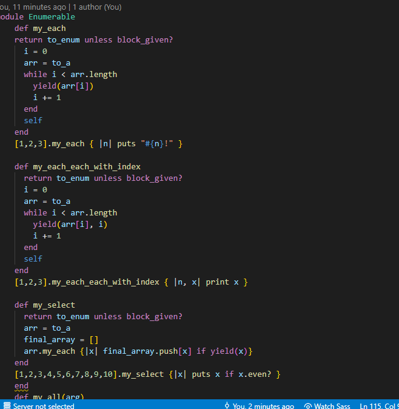

# Ruby-enumerables

Second ruby Project

Additional description about the project and its features.

This is a project to demonstrate the existing knowledge of Ruby. It is a Solo project recreating several enumerable methods in ruby

<i>Built With Ruby and VSCODE</i>

<h1>Getting Started</h1>

To get a local copy up and running follow these simple example steps.

Prerequisites Text editor,Github profile and Git.

<h2>Author</h2>

👤 Author

Github: @Nkuria Linkedin: [Nick-github-link](https://www.linkedin.com/in/nick-kuria-a148931a9/)

🤝 Contributing Contributions, issues and feature requests are welcome!

Feel free to check the issues page.

## Acknowledgments and licenses

Show your support Give a ⭐️ if you like this project!

Acknowledgments Hat tip to anyone whose code was used Inspiration etc

📝 License This project is a solo project of a microverse student. All rights are reserved for Nick.